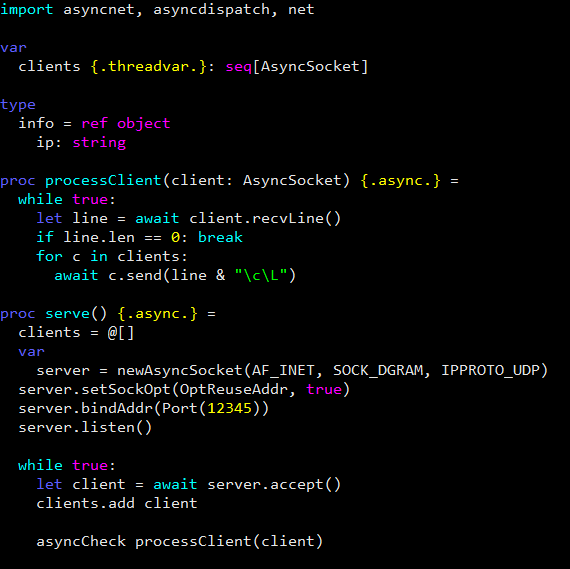

# Nanorc for Nim
A Nano editor syntax hightlight for the Nim programming language

## Installation
to make use of this file\
simply download and place the file in the local ~/.nano/ directory for **single user** configuration
```bash
# (for current user only)
# Create the directory in case it doesn't exist
mkdir ~/.nano
# Download and place file
wget https://raw.githubusercontent.com/oples/nanorc-nim/master/nim.nanorc -O ~/.nano/nim.nanorc

# System wide installation (Sudo or root access is required)
wget https://raw.githubusercontent.com/oples/nanorc-nim/master/nim.nanorc -O /usr/share/nano/nim.nanorc
```
## Examples
here's an example of the highlighted syntax<br/><br/>


## Info
Pull requests and issues are welcomed!
